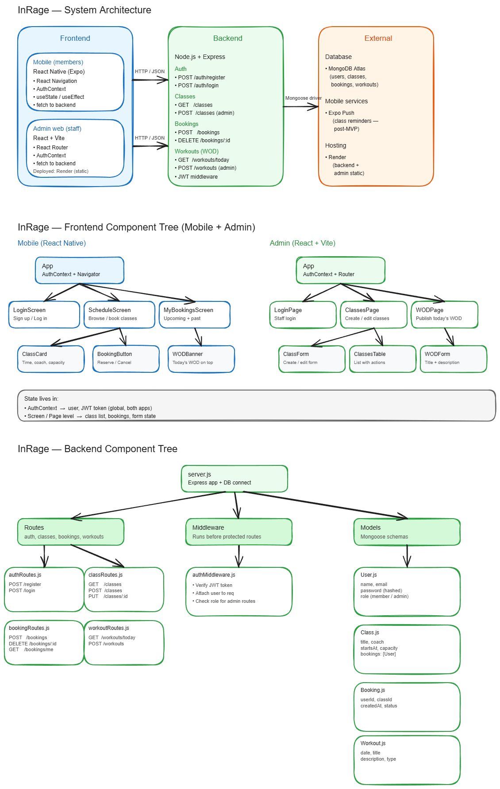

# InRage — Development Log

Capstone project for the Circuit Stream / UBC Extended Learning Full-Stack Software Development bootcamp. This devlog tracks the four capstone weeks: what got built, what broke, and what I learned.

> Stack: React Native (Expo) + React/Vite + Node/Express + MongoDB Atlas. See [README.md](../README.md) for the full overview.

---

## Week 1 — Proposal & Design (May 18–24, 2026)

**Goal:** decide what to build and design it before writing any code.

**Done**
- Wrote and submitted the [project proposal](Proposal.md): a gym management platform for a real CrossFit box (InRage CrossFit, Tampico, Mexico) — members use a mobile app, staff use a web admin panel.
- Decided the platform split in [PLATFORM_AND_NAVIGATION.md](PLATFORM_AND_NAVIGATION.md): React Native (Expo) as the primary evaluated platform, with a React web companion for staff. Bottom tabs on mobile, top navbar on admin.
- Mapped the full user flow (athlete + admin + the bridge between both apps) in [USER_FLOW.md](USER_FLOW.md).
- Wireframed all 10 screens — [WIREFRAMES.md](WIREFRAMES.md) and [InRage-Wireframes.pdf](InRage-Wireframes.pdf).
- Sketched the architecture in Excalidraw:



**Key decision:** monorepo with three packages (`backend/`, `mobile-new/`, `admin/`) sharing one REST API. Designing the data model up front (Member, Workout, Attendance, GymInfo, LoginLog, PR) made the following weeks much faster.

---

## Week 2 — Backend (May 25 – June 3, 2026)

**Goal:** a complete REST API with authentication, so both clients can be built against real data.

**Done**
- Express 4 + Mongoose 8 with six models and full CRUD routes.
- JWT auth: register/login with bcrypt-hashed passwords, 7-day tokens, and a Passport.js (`passport-jwt`) strategy behind a reusable `protect` middleware.
- Role-based access: `adminOnly` middleware gates staff routes (member list, WOD publishing, access logs).

```js
// middleware/authMiddleware.js — the whole authorization story in 10 lines
export const protect = passport.authenticate('jwt', { session: false });

export const adminOnly = (req, res, next) => {
  if (req.user?.role !== 'admin') {
    return res.status(403).json({ message: 'Admin access required' });
  }
  next();
};
```

- Login/register events recorded to a `LoginLog` collection (fire-and-forget, never blocks the auth response) — this powers the admin "Accesos" tab.
- Seed script for development data.

**Challenge:** Google sign-in verification server-side. Instead of pulling in the whole `google-auth-library`, the backend validates the ID token against Google's public `tokeninfo` endpoint with a plain `fetch` — zero extra dependencies, and the `aud` claim is checked against our client ID when configured.

**Learned:** separating `protect` (authentication) from `adminOnly` (authorization) keeps routes declarative: `router.get('/', protect, adminOnly, listMembers)` reads like documentation.

---

## Week 3 — Frontend (June 1–7, 2026)

**Goal:** every screen built on both clients, connected to the real API, with loading/empty/error states.

**Done**
- **Mobile (Expo SDK 54):** login + register (email and Google), home with today's WOD, gym info + daily announcement, check-in/check-out, profile with avatar, personal records (PRs) for Olympic lifting / powerlifting / gymnastics movements.
- **Admin (React + Vite):** member approval flow ("Dar de alta"), member list with last login, WOD publishing, gym info editor, real-time access log.
- Approval gating: self-registered members start as `pending` and see a waiting screen with gym info until staff approves them — only `active` members get the full app.
- Every screen covers happy / loading / empty / error states (matrix in [WEEK3_STATUS.md](WEEK3_STATUS.md)).
- Deployment config written: [render.yaml](../render.yaml) blueprint + [DEPLOYMENT.md](DEPLOYMENT.md) runbook.

**Challenge of the week (the nasty one):** the project lives in a OneDrive folder, and OneDrive's "files on demand" turns directories into cloud-placeholder reparse points. Metro (React Native's bundler) silently **cannot see new files** created inside those directories — imports failed for files that clearly existed on disk. Hours of confusion until the cause was found. Fix: rebuild the affected source directories as plain local folders (and keep them "always on this device"). This is also why the app lives in `mobile-new/` — the original `mobile/` scaffold was abandoned during the rebuild.

**Nice win:** the mobile app auto-detects the development machine's LAN IP from the Metro host URL, so testing on a real phone needs zero manual IP configuration.

---

## Week 4 — Testing, Deployment & Polish (June 8–14, 2026)

**Goal:** tests, live deployment, containerization, and final documentation.

**Done**
- **Unit tests** with Node's built-in test runner (`node --test`) — zero new dependencies. 21 tests covering:
  - `adminOnly`, `errorHandler`, and `notFound` middleware in isolation (mocked `req`/`res`);
  - the JWT contract (round-trip, 7-day expiry, tampered/expired/wrong-secret rejection);
  - the real HTTP surface on an ephemeral port: `/health`, 404 handling, and that every protected route rejects unauthenticated requests with 401 — no database required.
- **Refactor for testability:** split `src/index.js` into `createApp()` (builds the Express app) and a thin entry point that connects MongoDB and listens. Tests boot the real app; production behavior is unchanged.

```js
// tests can now do this — real app, ephemeral port, no DB:
const app = createApp();
server = app.listen(0);
```

- **Deployment:** backend live on Render (`/health` returns `{"status":"ok"}` in production), admin deployed as a Render static site, mobile shared via Expo. The mobile app's `apiUrl` now points at the production API.
- **Docker:** `backend/Dockerfile` (node:20-alpine), multi-stage `admin/Dockerfile` (Vite build → nginx with SPA rewrite), and a `docker-compose.yml` to run the whole stack locally with one command.
- README finalized (API reference, quick start, live URLs) and this devlog written.

**Challenge:** Render's free tier spins services down after inactivity — the first request after a quiet period takes ~30–60 s (cold start). Worth knowing before a demo: hit `/health` first.

**Learned:** Node's native test runner is genuinely enough for a project this size — no Jest config, no ESM headaches. And extracting `createApp()` from the server entry point is a tiny refactor that makes an Express app testable forever after.

---

## Retrospective

**What went well**
- Designing the data model and wireframes in week 1 meant almost no rework later.
- One REST API serving two very different clients (mobile members, web staff) validated the separation-of-concerns design.
- Building for a real gym kept scope honest: every feature answers a real need (approval flow, daily announcement, PR tracking).

**What I'd do differently**
- Keep code projects out of OneDrive-synced folders from day one.
- Write tests alongside the backend in week 2 instead of in week 4 — the `createApp()` split should have been the starting shape.

**Top 3 takeaways**
1. Auth is layers: hashing (bcrypt) → identity (JWT) → authentication middleware (Passport) → authorization middleware (roles). Keeping each layer tiny makes the whole thing debuggable.
2. Loading/empty/error states are not polish — they're half the frontend work, and planning them per-screen (week 3 matrix) made them tractable.
3. Deployment config as code (`render.yaml`, Dockerfiles) turns "deploy day" from a scary milestone into a button press.
